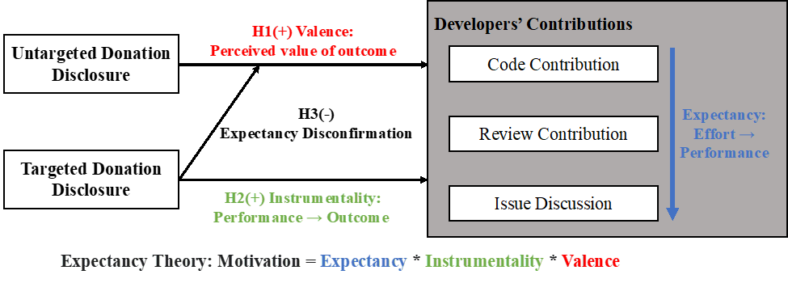
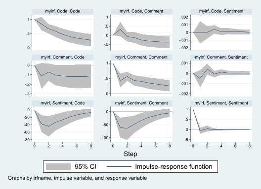

## 研究一：捐赠信息披露对开发者活动的影响

## 研究二：社区讨论情感对开发者活动的影响

### 描述统计

. estpost tabstat sentiment_polarity_score Code Comment return donation grant, statistics(mean	sd	min	max	n)	columns(statistics)

Summary statistics: mean sd min max count
for variables: sentiment_polarity_score Code Comment return donation grant

e(mean)      e(sd)     e(min)     e(max)   e(count) 

sentiment_~e   5.026316   .6282809          3          7        209 
Code   333.4713   158.2388         11        922        209 
Comment   604.9833   242.5168         53       1479        209 
return   .0075584   .0875551  -.4145639   .3203673        209 
donation   42870.81   369087.5          0    5000000        209 
grant   .0382775   .3077038          0          4        209 

### 最优滞后阶数的选择

. varsoc Sentiment Code Comment , exog(return donation grant) maxlag(8)

Lag-order selection criteria

   Sample: 8 thru 208                                      Number of obs = 201
  +---------------------------------------------------------------------------+
  | Lag |    LL      LR      df    p     FPE       AIC      HQIC      SBIC    |
  |-----+---------------------------------------------------------------------|
  |   0 | -2829.39                     3.8e+08   28.2725   28.3523   28.4697  |
  |   1 | -2586.23  486.32    9  0.000 3.7e+07   25.9426   26.0822   26.2877* |
  |   2 | -2566.63  39.192*   9  0.000 3.3e+07*  25.8372*  26.0367*  26.3302  |
  |   3 | -2559.75  13.772    9  0.131 3.4e+07   25.8582   26.1176   26.4991  |
  |   4 | -2556.65  6.1925    9  0.721 3.6e+07   25.9169   26.2361   26.7058  |
  |   5 | -2549.42  14.458    9  0.107 3.7e+07   25.9346   26.3136   26.8713  |
  |   6 | -2546.56  5.7366    9  0.766 3.9e+07   25.9956   26.4345   27.0802  |
  |   7 | -2542.46   8.186    9  0.516 4.1e+07   26.0444   26.5432    27.277  |
  |   8 |  -2536.3  12.328    9  0.195 4.2e+07   26.0726   26.6312   27.4531  |
  +---------------------------------------------------------------------------+
   * optimal lag
      Endogenous: Sentiment Code Comment

    Exogenous: return donation grant  _cons

. 
end of do-file

### var结果

. varsoc Sentiment Code Comment , exog(return donation grant) maxlag(8)

Lag-order selection criteria

   Sample: 8 thru 208                                      Number of obs = 201
  +---------------------------------------------------------------------------+
  | Lag |    LL      LR      df    p     FPE       AIC      HQIC      SBIC    |
  |-----+---------------------------------------------------------------------|
  |   0 | -2829.39                     3.8e+08   28.2725   28.3523   28.4697  |
  |   1 | -2586.23  486.32    9  0.000 3.7e+07   25.9426   26.0822   26.2877* |
  |   2 | -2566.63  39.192*   9  0.000 3.3e+07*  25.8372*  26.0367*  26.3302  |
  |   3 | -2559.75  13.772    9  0.131 3.4e+07   25.8582   26.1176   26.4991  |
  |   4 | -2556.65  6.1925    9  0.721 3.6e+07   25.9169   26.2361   26.7058  |
  |   5 | -2549.42  14.458    9  0.107 3.7e+07   25.9346   26.3136   26.8713  |
  |   6 | -2546.56  5.7366    9  0.766 3.9e+07   25.9956   26.4345   27.0802  |
  |   7 | -2542.46   8.186    9  0.516 4.1e+07   26.0444   26.5432    27.277  |
  |   8 |  -2536.3  12.328    9  0.195 4.2e+07   26.0726   26.6312   27.4531  |
  +---------------------------------------------------------------------------+
   * optimal lag
      Endogenous: Sentiment Code Comment

    Exogenous: return donation grant  _cons

. 
end of do-file

. do "C:\Users\rhys\AppData\Local\Temp\STD44b0_000000.tmp"

. var Sentiment Code Comment, exog(return donation grant) lags(1/2) dfk

Vector autoregression

Sample: 2 thru 208                              Number of obs     =        207
Log likelihood =  -2658.878                     AIC               =   25.97949
FPE            =   3.85e+07                     HQIC              =   26.17482
Det(Sigma_ml)  =   2.88e+07                     SBIC              =    26.4625

Equation           Parms      RMSE     R-sq      chi2     P>chi2

Sentiment            10       .6133   0.0760    16.1961   0.0629
Code                 10     99.4518   0.6165   316.6688   0.0000

Comment              10     167.368   0.5484   239.2006   0.0000

------------------------------------------------------------------------------
             | Coefficient  Std. err.      z    P>|z|     [95% conf. interval]
-------------+----------------------------------------------------------------
Sentiment    |
   Sentiment |
         L1. |  -.0532209   .0709755    -0.75   0.453    -.1923302    .0858885
         L2. |   .0096394   .0720861     0.13   0.894    -.1316467    .1509255
             |
        Code |
         L1. |   9.41e-06   .0007336     0.01   0.990    -.0014283    .0014472
         L2. |   .0001756   .0007319     0.24   0.810     -.001259    .0016102
             |
     Comment |
         L1. |  -.0005241   .0004257    -1.23   0.218    -.0013584    .0003102
         L2. |   .0006021   .0004245     1.42   0.156    -.0002299    .0014341
             |
      return |   .7074765    .493719     1.43   0.152    -.2601949    1.675148
    donation |   2.28e-07   1.17e-07     1.96   0.051    -5.41e-10    4.57e-07
       grant |  -.0761175   .1411326    -0.54   0.590    -.3527323    .2004973
       _cons |   5.113723   .5126517     9.98   0.000     4.108944    6.118502
-------------+----------------------------------------------------------------
Code         |
   Sentiment |
         L1. |  -37.19879   11.50928    -3.23   0.001    -59.75657     -14.641
         L2. |  -21.71089   11.68938    -1.86   0.063    -44.62166    1.199869
             |
        Code |
         L1. |    .853343   .1189532     7.17   0.000     .6201991    1.086487
         L2. |  -.0217999   .1186907    -0.18   0.854    -.2544293    .2108296
             |
     Comment |
         L1. |   -.112702   .0690278    -1.63   0.103    -.2479939      .02259
         L2. |   .0523864   .0688358     0.76   0.447    -.0825293    .1873021
             |
      return |   55.75503   80.06079     0.70   0.486    -101.1612    212.6713
    donation |   .0000289   .0000189     1.53   0.127    -8.18e-06     .000066
       grant |   26.43139   22.88586     1.15   0.248    -18.42408    71.28685
       _cons |   386.3382   83.13088     4.65   0.000     223.4047    549.2717
-------------+----------------------------------------------------------------
Comment      |
   Sentiment |
         L1. |  -61.23034   19.36898    -3.16   0.002    -99.19285   -23.26783
         L2. |  -27.35348   19.67207    -1.39   0.164    -65.91002    11.20306
             |
        Code |
         L1. |   .3414973   .2001864     1.71   0.088    -.0508609    .7338555
         L2. |  -.5158199   .1997447    -2.58   0.010    -.9073123   -.1243276
             |
     Comment |
         L1. |    .433486   .1161669     3.73   0.000      .205803     .661169
         L2. |   .3787957   .1158438     3.27   0.001     .1517459    .6058454
             |
      return |   181.3409   134.7344     1.35   0.178    -82.73359    445.4154
    donation |   .0000168   .0000318     0.53   0.598    -.0000456    .0000792
       grant |   38.08651   38.51464     0.99   0.323    -37.40079    113.5738

​       _cons |    611.433    139.901     4.37   0.000      337.232     885.634

. 
end of do-file

### 格兰杰因果检验结果

 vargranger

   Granger causality Wald tests
  +------------------------------------------------------------------+
  |          Equation           Excluded |   chi2     df Prob > chi2 |
  |--------------------------------------+---------------------------|
  |         Sentiment               Code |  .33024     2    0.848    |
  |         Sentiment            Comment |  2.0119     2    0.366    |
  |         Sentiment                ALL |  7.0026     4    0.136    |
  |--------------------------------------+---------------------------|
  |              Code          Sentiment |  13.967     2    0.001    |
  |              Code            Comment |  4.4061     2    0.110    |
  |              Code                ALL |    19.1     4    0.001    |
  |--------------------------------------+---------------------------|
  |           Comment          Sentiment |  11.979     2    0.003    |
  |           Comment               Code |  8.6502     2    0.013    |
  |           Comment                ALL |  20.942     4    0.000    |
  +------------------------------------------------------------------+

. 
end of do-file

## 脉冲响应函数图

### 方差分解

#### response code

irf table fevd, response(Code)

Results from myirf

-------------------------------------------------------------------------------------------------------------------
         |      (1)         (1)         (1)         (2)         (2)         (2)         (3)         (3)         (3)  
    Step |     fevd       Lower       Upper        fevd       Lower       Upper        fevd       Lower       Upper  
---------+---------------------------------------------------------------------------------------------------------
       0 |        0           0           0           0           0           0           0           0           0
       1 |  .044191    -.010552     .098935     .955809     .901065     1.01055           0           0           0
       2 |  .034885     .003244     .066526     .957005     .920215     .993795      .00811    -.011363     .027582
       3 |  .042275     .003862     .080688     .948337     .905256     .991418     .009388    -.011319     .030095
       4 |  .045288    -.001232     .091809     .941227     .888158     .994296     .013484    -.014194     .041163
       5 |  .047429    -.005301     .100159     .934301     .871787     .996816     .018269    -.017709     .054247
       6 |  .048365    -.007578     .104308     .928079     .857638      .99852     .023556    -.022053     .069164
       7 |  .048663    -.008821     .106146     .922332     .844394     1.00027     .029006    -.026712     .084724

​       8 |  .048663    -.009525     .106851     .916997     .831735     1.00226      .03434    -.031414     .100095

95% lower and upper bounds reported.
(1) irfname = myirf, impulse = Sentiment, and response = Code.
(2) irfname = myirf, impulse = Code, and response = Code.
(3) irfname = myirf, impulse = Comment, and response = Code.

#### response Comment

 do "C:\Users\rhys\AppData\Local\Temp\STD44b0_000000.tmp"

. irf table fevd, response(Comment)

Results from myirf

-------------------------------------------------------------------------------------------------------------------
         |      (1)         (1)         (1)         (2)         (2)         (2)         (3)         (3)         (3)  
    Step |     fevd       Lower       Upper        fevd       Lower       Upper        fevd       Lower       Upper  
---------+---------------------------------------------------------------------------------------------------------
       0 |        0           0           0           0           0           0           0           0           0
       1 |  .039869    -.012364     .092101     .624646     .541018     .708274     .335485     .260975     .409996
       2 |  .035848     .001758     .069938     .672142     .584555     .759729      .29201     .211106     .372914
       3 |  .039978     .002955     .077001     .653816     .557167     .750465     .306206      .21683     .395583
       4 |   .04278    -.000601     .086161     .641509     .534862     .748156     .315711     .215755     .415668
       5 |  .043916    -.003855     .091687     .626919     .511847      .74199     .329166     .220104     .438227
       6 |  .044186    -.005467      .09384     .614738     .492759     .736717     .341076     .223932      .45822
       7 |  .043938    -.006277     .094153     .604544     .477039      .73205     .351518     .227511     .475525

​       8 |  .043533    -.006651     .093717     .596294     .464185     .728404     .360173     .230291     .490054

95% lower and upper bounds reported.
(1) irfname = myirf, impulse = Sentiment, and response = Comment.
(2) irfname = myirf, impulse = Code, and response = Comment.
(3) irfname = myirf, impulse = Comment, and response = Comment.

### 稳健性检验

#### 1.更换情感变量：只提取负向情感进行研究

. gen Negative = 0

. replace Negative = (sentiment_polarity_score - 5) * -1 if sentiment_polarity_score < 5
(30 real changes made)

. gen Positive = 0

. replace Positive = sentiment_polarity_score - 5 if sentiment_polarity_score > 5
(32 real changes made)

. var Negative Code Comment, exog(return donation grant) lags(1/2) dfk

Vector autoregression

Sample: 2 thru 208                              Number of obs     =        207
Log likelihood =  -2565.878                     AIC               =   25.08095
FPE            =   1.57e+07                     HQIC              =   25.27627
Det(Sigma_ml)  =   1.17e+07                     SBIC              =   25.56395

Equation           Parms      RMSE     R-sq      chi2     P>chi2

Negative             10     .380324   0.0644   13.55901   0.1389
Code                 10     101.352   0.6017   297.5901   0.0000

Comment              10     170.125   0.5334   225.1726   0.0000

------------------------------------------------------------------------------
             | Coefficient  Std. err.      z    P>|z|     [95% conf. interval]
-------------+----------------------------------------------------------------
Negative     |
    Negative |
         L1. |  -.0938569   .0711912    -1.32   0.187    -.2333891    .0456754
         L2. |   -.098244    .071166    -1.38   0.167    -.2377268    .0412387
             |
        Code |
         L1. |  -.0005122   .0004525    -1.13   0.258     -.001399    .0003746
         L2. |   .0003383   .0004515     0.75   0.454    -.0005465    .0012231
             |
     Comment |
         L1. |   .0005499   .0002635     2.09   0.037     .0000335    .0010663
         L2. |  -.0006164   .0002628    -2.35   0.019    -.0011315   -.0001014
             |
      return |   .0733495   .3062483     0.24   0.811    -.5268861    .6735851
    donation |  -5.18e-08   7.21e-08    -0.72   0.473    -1.93e-07    8.95e-08
       grant |  -.0027564   .0876171    -0.03   0.975    -.1744827    .1689699
       _cons |   .2822036   .0877844     3.21   0.001     .1101492    .4542579
-------------+----------------------------------------------------------------
Code         |
    Negative |
         L1. |   16.17625   18.97164     0.85   0.394    -21.00748    53.35998
         L2. |    45.4131   18.96491     2.39   0.017     8.242562    82.58364
             |
        Code |
         L1. |   .8423693   .1205729     6.99   0.000     .6060507    1.078688
         L2. |  -.0094378    .120309    -0.08   0.937    -.2452391    .2263636
             |
     Comment |
         L1. |  -.1214404   .0702171    -1.73   0.084    -.2590634    .0161827
         L2. |    .059314   .0700252     0.85   0.397    -.0779329    .1965609
             |
      return |   55.80251   81.61162     0.68   0.494    -104.1533    215.7584
    donation |   .0000246   .0000192     1.28   0.201    -.0000131    .0000622
       grant |   28.39447   23.34893     1.22   0.224     -17.3686    74.15754
       _cons |    82.1813   23.39354     3.51   0.000     36.33081    128.0318
-------------+----------------------------------------------------------------
Comment      |
    Negative |
         L1. |    26.1414    31.8451     0.82   0.412    -36.27386    88.55665
         L2. |   70.31633   31.83381     2.21   0.027     7.923219    132.7094
             |
        Code |
         L1. |    .316327   .2023893     1.56   0.118    -.0803487    .7130028
         L2. |  -.4885412   .2019463    -2.42   0.016    -.8843488   -.0927337
             |
     Comment |
         L1. |   .4159726   .1178639     3.53   0.000     .1849636    .6469817
         L2. |    .393668   .1175418     3.35   0.001     .1632903    .6240456
             |
      return |   181.2151   136.9903     1.32   0.186    -87.28097    449.7111
    donation |   .0000108   .0000322     0.34   0.738    -.0000524     .000074
       grant |   41.27947   39.19267     1.05   0.292    -35.53675    118.0957

​       _cons |   153.4595   39.26754     3.91   0.000     76.49657    230.4225

. 

end of do-file

#### 2.更换讨论变量

由于PullRequestReviewCommentEvent和代码活动、讨论活动都紧密相关，而且其中的评论也参与情感的计算，剔除这种活动

. var Sentiment Code IssueDiscussion, exog(return donation grant) lags(1/2) dfk

Vector autoregression

Sample: 2 thru 208                              Number of obs     =        207
Log likelihood =  -2628.639                     AIC               =   25.68733
FPE            =   2.87e+07                     HQIC              =   25.88265
Det(Sigma_ml)  =   2.15e+07                     SBIC              =   26.17033

Equation           Parms      RMSE     R-sq      chi2     P>chi2

Sentiment            10     .613649   0.0749   15.95366   0.0679
Code                 10     99.9983   0.6123   311.0698   0.0000

IssueDiscussion      10     110.527   0.5223   215.3929   0.0000

---------------------------------------------------------------------------------
                | Coefficient  Std. err.      z    P>|z|     [95% conf. interval]
----------------+----------------------------------------------------------------
Sentiment       |
      Sentiment |
            L1. |  -.0506814   .0711704    -0.71   0.476    -.1901729    .0888101
            L2. |   .0054664   .0725284     0.08   0.940    -.1366867    .1476195
                |
           Code |
            L1. |  -.0003332   .0005649    -0.59   0.555    -.0014405     .000774
            L2. |   .0005337   .0005629     0.95   0.343    -.0005696     .001637
                |
IssueDiscussion |
            L1. |  -.0005557    .000495    -1.12   0.262    -.0015259    .0004145
            L2. |   .0006535   .0004918     1.33   0.184    -.0003104    .0016174
                |
         return |   .7213582   .4935102     1.46   0.144    -.2459041    1.688621
       donation |   2.23e-07   1.17e-07     1.91   0.056    -5.55e-09    4.52e-07
          grant |  -.0870284   .1409444    -0.62   0.537    -.3632742    .1892175
          _cons |   5.127239   .5144743     9.97   0.000     4.118888     6.13559
----------------+----------------------------------------------------------------
Code            |
      Sentiment |
            L1. |  -37.69482   11.59771    -3.25   0.001    -60.42592   -14.96372
            L2. |  -21.72734   11.81901    -1.84   0.066    -44.89217    1.437487
                |
           Code |
            L1. |   .7634699   .0920581     8.29   0.000     .5830393    .9439005
            L2. |   .0532879   .0917298     0.58   0.561    -.1264992     .233075
                |
IssueDiscussion |
            L1. |  -.0813686   .0806654    -1.01   0.313    -.2394698    .0767327
            L2. |   .0079677   .0801428     0.10   0.921    -.1491092    .1650446
                |
         return |   50.95321   80.42091     0.63   0.526    -106.6689    208.5753
       donation |   .0000292    .000019     1.53   0.125    -8.09e-06    .0000664
          grant |   26.10193   22.96786     1.14   0.256    -18.91426    71.11811
          _cons |   385.6932   83.83714     4.60   0.000     221.3754     550.011
----------------+----------------------------------------------------------------
IssueDiscussion |
      Sentiment |
            L1. |  -43.12545   12.81879    -3.36   0.001    -68.24981   -18.00109
            L2. |  -17.02075   13.06338    -1.30   0.193     -42.6245    8.583011
                |
           Code |
            L1. |   .1714852   .1017505     1.69   0.092    -.0279422    .3709126
            L2. |  -.2619172   .1013877    -2.58   0.010    -.4606333    -.063201
                |
IssueDiscussion |
            L1. |    .458968   .0891583     5.15   0.000     .2842209    .6337152
            L2. |   .3206972   .0885807     3.62   0.000     .1470824    .4943121
                |
         return |   144.3272    88.8881     1.62   0.104    -29.89023    318.5447
       donation |   9.79e-06    .000021     0.47   0.641    -.0000314     .000051
          grant |   20.67558   25.38605     0.81   0.415    -29.08017    70.43133

​          _cons |   413.5677   92.66401     4.46   0.000     231.9495    595.1858

. 
end of do-file

#### 